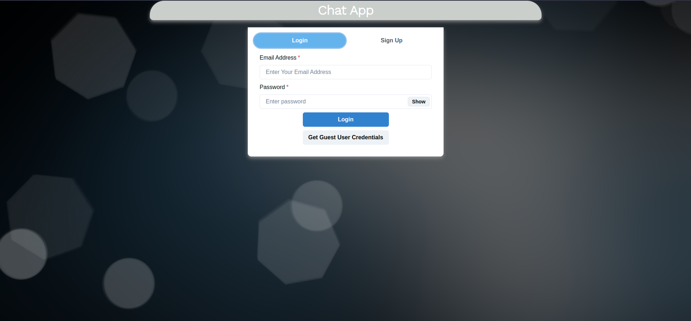
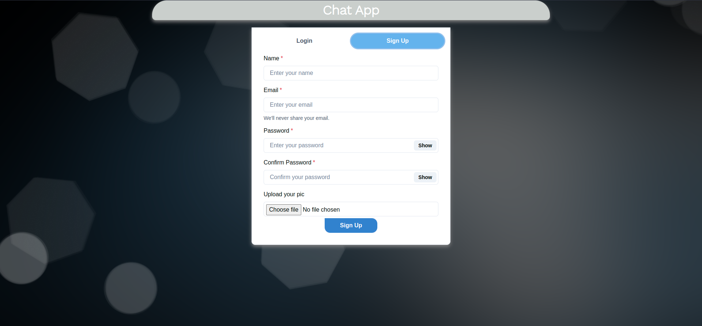
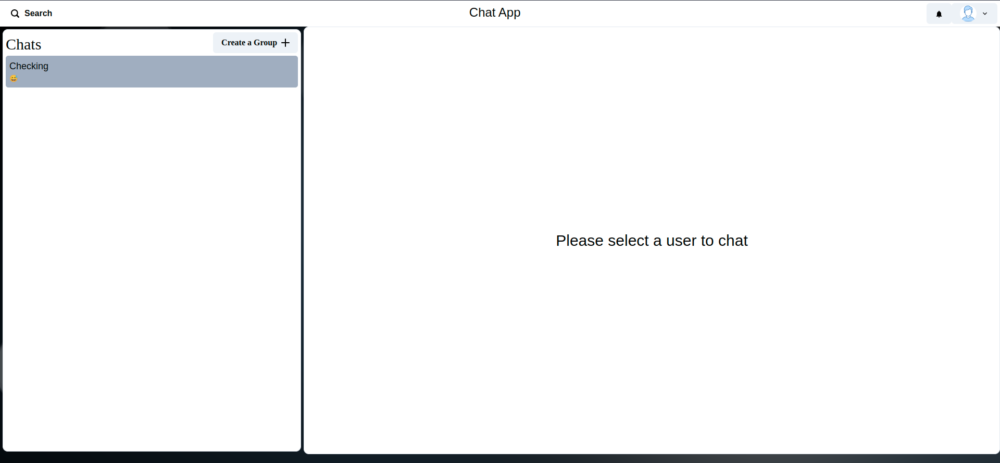
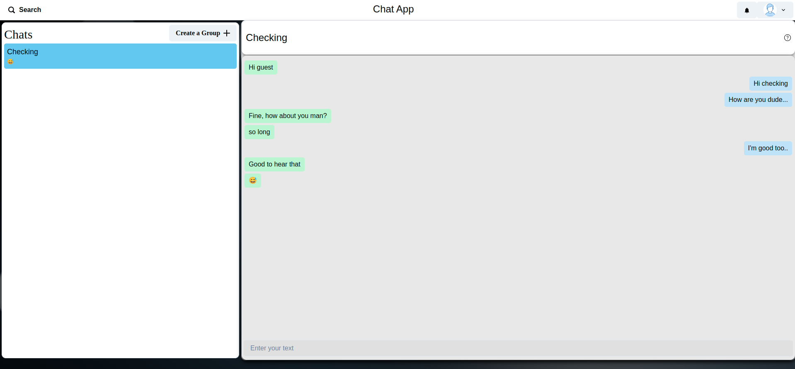
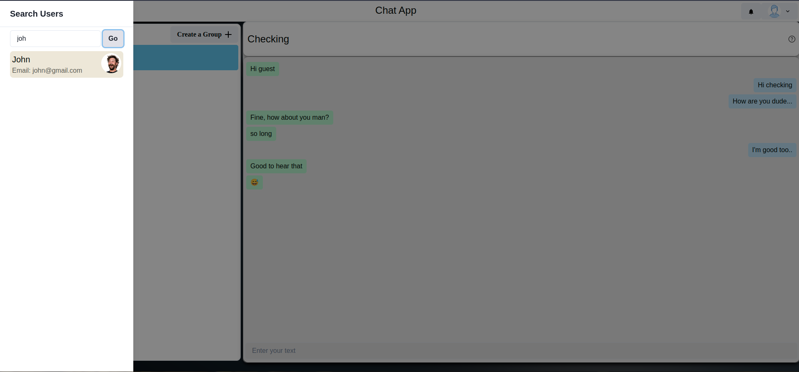

## Web-Chat-Application

A web chat application that provides both peer to peer(P2P) and group chat(broadcasting) functionality for users. User chat is
persistent as we're using mongodb atlas database service to store user login information along with their chat data.

## Motivation

- To explore web technologies and to gain hands-on experience of building a full-stack application.

## Features

- User Authentication
- P2P messaging
- Group messaging
- Real-Time communication
- User searching

## Tech-Stack

- **Frontend**
  - [ReactJS](https://reactjs.org/) A JavaScript library for building user interfaces
  - [Chakra UI](https://chakra-ui.com/) modular and accessible component library for building react applications
- **Backend**
  - [Go](https://go.dev/) An open-source programming language primarily used for building robust serverside applications, CLI's, etc
  - [Gin](https://gin-gonic.com/) A web framework used to create highly scalable web servers
  - [MongoDB](https://www.mongodb.com/) An open-source document-oriented database and leading NoSQL database

## Screenshots

|                                              |                                        |
| -------------------------------------------- | -------------------------------------- |
|             |     |
|          |  |
|  |                                        |

### Prerequisites

- [Go](https://go.dev/dl/)
- [Node JS](https://nodejs.org/en/download/)
- [MongoDB Atlas](https://www.mongodb.com/cloud/atlas/register)
  > Note: Check out the [Get Started](https://www.mongodb.com/docs/atlas/getting-started/) guide by [MongoDB Atlas](https://www.mongodb.com/docs/atlas/) to set up the your atlas account, of course they have free tire.
- [Docker](https://www.docker.com/products/docker-desktop/) and [Docker Compose](https://docker-docs.netlify.app/compose/install/) if following docker setup

## Local Setup

_Docker setup_

1. For docker setup, ensure **docker** and **docker-compose** are installed

2. Clone the respository

```
git clone https://github.com/PMohanJ/Web-chat-application.git
```

3. Change directory to application

```
cd Web-chat-application
```

4. Run the below command to pull the images

```
docker-compose pull
```

5. Create and run the services

```
docker-compose up    # up creates and starts containers
```

> Note: The above command pulls the images from docker hub. If you want to run application with your modification, just remove/change the _image_ key field in the frontend and backend services of [docker-compose](./docker-compose.yml) file

<br/>

_Non Docker Setup_

1. Clone the respository

```
git clone https://github.com/PMohanJ/Web-chat-application.git
```

2. Change directory to application

```
cd Web-chat-application
```

3. Change directory and Start frontend react server

```
cd frontend && npm start
```

4. Now change directory to backend and replace the .env variables with your details

```
MONGODB_URL = "mongodb+srv://mohanj:<password>@cluster0.f2pstnw.mongodb.net/?retryWrites=true&w=majority"
# replace the above with your mongodb cloud URL

SECRET_KEY = "replacethiswithyourownsecretkey"
```

5. Run the main.go

```
go run main.go
```

> Note: Frontend runs at localhost:3000, and backend at localhost:8000, make sure these ports are free.

## Todo

- [] Provide an option to delete the chat conversation of users
- [] Provide an option to delete and edit a message

## Further Development

- To add notification feature to alert user upon receiving new messages
- To provide typing indication to the receiver when the sender is a typing message
